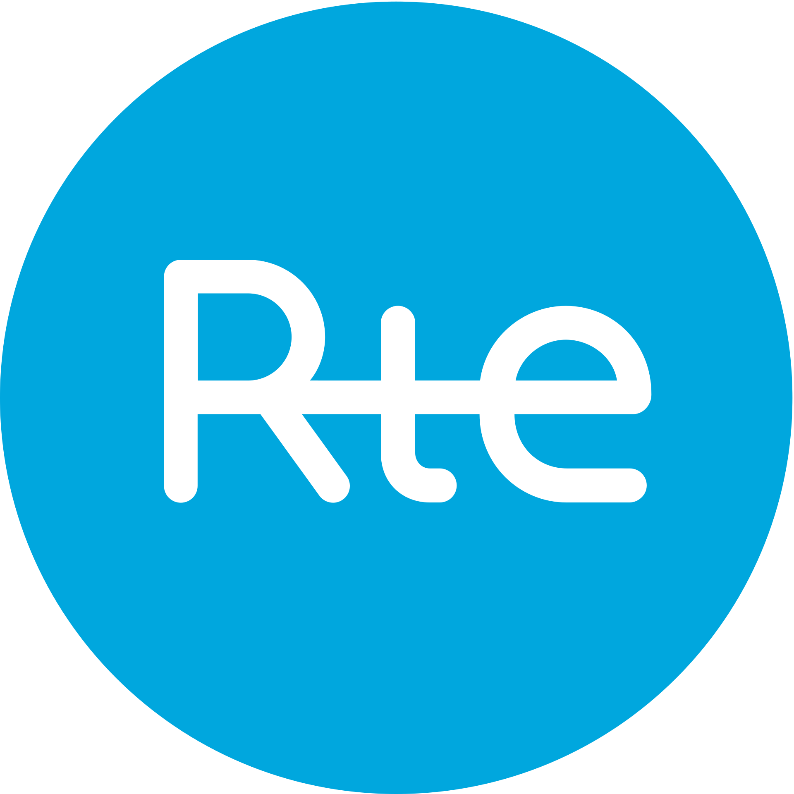
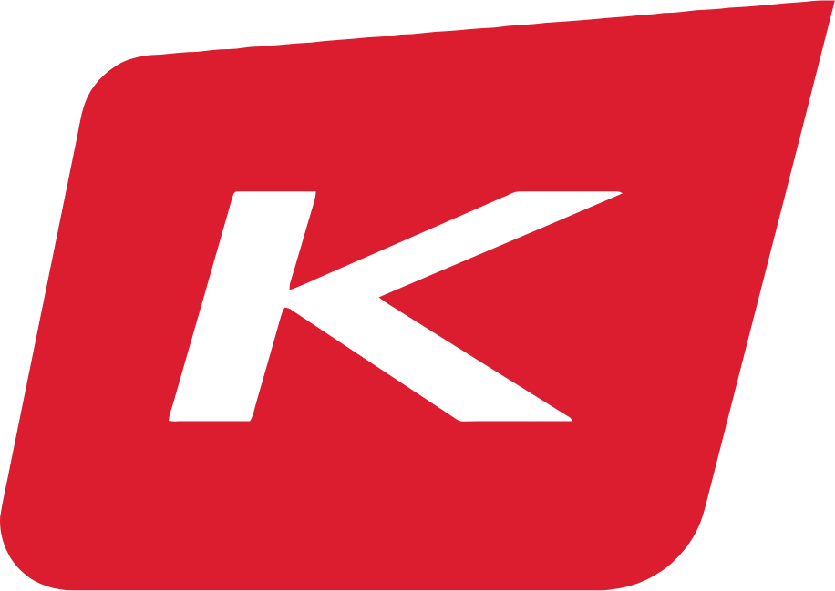
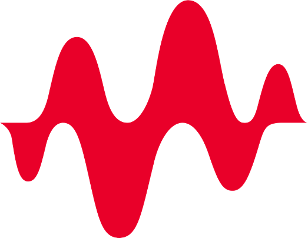

**About Me**
======

 

I am a fifth-year Ph.D. candidate in the H. Milton Stewart School of Industrial and Systems Engineering (<a href="https://www.isye.gatech.edu/">ISyE</a>) and a research assistant at NSF Artificial Intelligence Research Institute for Advances in Optimization (<a href="https://www.ai4opt.org/">AI4OPT</a>) at <a href="https://www.gatech.edu/">Georgia Tech</a>, advised by Prof. <a href="https://sites.gatech.edu/pascal-van-hentenryck/">Pascal Van Hentenryck</a>.    

My research focuses on developing <b> principled integration of Machine Learning and Mathematical Optimization to enable reliable, efficient, and scalable decision-making for systems at a massive scale driven by societal challenges in energy, transportation and sustainability </b>. 

The methodologies bring benefits to the areas of Machine Learning (ML) and Operations Research (OR):     
1. <b> Machine Learning for Real-Time Optimization </b>: On the OR side, my research enables real-time decision making at scale by developing optimization proxies that approximate computationally expensive optimization models. The methodologies have led to several significant and impactful applications. One is the first scalable real-time risk assessment in energy systems (see [<a href="https://ieeexplore.ieee.org/document/10256159">paper1</a>], [<a href="https://arxiv.org/pdf/2310.00709.pdf">paper2</a>], [<a href="https://www.sciencedirect.com/science/article/abs/pii/S0378779622006629">paper3</a>]), built on the <a href="https://arpa-e.energy.gov/technologies/projects/risk-aware-market-clearing-power-systems-ramc">PERFORM project of ARPA-E</a>
, in partnership with the Midcontinent Independent System Operator (<a href="https://www.misoenergy.org/">MISO</a>) and France’s transmission system operator (<a href="https://www.rte-france.com/en/home">RTE</a>). Another is achieving fast load planning in industrial-size trucking service networks (see [<a href="https://arxiv.org/pdf/2307.04050.pdf">paper</a>]), in partnership with a major parcel delivery company in the world.     
2. <b>Optimization for Reliable Machine Learning </b>: On the ML side, my research enables reliable and robust ML models by developing scalable differentiable optimization layer to ensure ML models’ outputs satisfy hard constraints and specifications (see [<a href="https://ieeexplore.ieee.org/document/10256159">paper</a>]), designing formal verification to prove ML models’ exact robustness and developing conformal prediction to provide statistical guarantees on model performances. 

  

**News**
======

<b>I'm in the Academic Job Market 2023-24</b>

---
[03/2024] My research work "Real-Time Risk Assessment in Power System" has been highlighted in the latest [AI Magazine about NSF's National AI Institutes](https://onlinelibrary.wiley.com/doi/epdf/10.1002/aaai.12146).

[01/2024] Our team won VNN-COMP’23 Award for outstanding benchmark. Check [here](https://github.com/Wenbo11/Wenbo11.github.io/blob/master/vnncomp2023_certificate_ml4acopf.pdf).

[11/2023] I won Anderson-Interface Fellowship for Excellence in Research in the area of Energy and Sustainable Systems.

[09/2023] Two papers accepted in IEEE Transactions on Power Systems. Check [paper](https://arxiv.org/pdf/2304.11726.pdf) and [paper](https://arxiv.org/pdf/2301.08840.pdf).

[07/2023] One paper accepted in IEEE Transactions on Power Systems. Check the [paper](https://arxiv.org/pdf/2211.15755.pdf).

[05/2023] I won thesis pitch competition for the ML and manufacturing track in [IISE Annual Meeting 2023](https://www.iise.org/Annual/)! Check the [news](https://www.ai4opt.org/news-events/wenbo-chen-wins-thesis-pitch-competition-ml-and-manufacturing).

[05/2023] I presented the advancement of [End to End Learning and Optimization](https://www.ai4opt.org/end-end-learning-and-optimization) thrust for AI4OPT External Advisory Board (EAB). Check the [news](https://www.ai4opt.org/news-events/ai4opt-holds-meeting-eab-discuss-latest-research-developments).

[04/2023] I will be presenting our work End-to-End Feasible Optimization Proxies for Large-Scale Economic Dispatch at the [INFORMS Annual Meeting 2023](https://meetings.informs.org/wordpress/phoenix2023/)

[03/2023] I will be presenting our work Confidence-Aware Graph Neural Networks for Learning Reliability Assessment Commitments at the [IISE Annual Meeting 2023](https://www.iise.org/Annual/)

[03/2023] Check out NSF AI4OPT [newsletter](https://www.ai4opt.org/sites/default/files/newsletter/march-2023.pdf)! I am in the student highlights.

[01/2023] I will attend [2023 Grid Science Winter School and Conference](https://web.cvent.com/event/e157468f-6e59-4b53-8a23-3874fe4ed31e/summary)

[10/2022] I will be presenting our work Learning Optimization Proxies for Large-Scale Security-Constrained Economic Dispatch dispatch at the [INFORMS Annual Meeting 2022](https://meetings.informs.org/wordpress/indianapolis2022/)

  

**Collaborations**
======
<html lang="en">
<head>
<!-- <meta charset="UTF-8"> -->
<!-- <meta name="viewport" content="width=device-width, initial-scale=1.0"> -->
<!-- <title>Corporate Collaboration Diagram</title> -->

</head>

My research has strong collaborations with several major companies in the fields of Energy, Sustainable Supply Chain and Trustworthy AI, working on improving their businesses and operations.

<body>

  

    <h2>Energy</h2>
    
    
  

  
  <!-- 

 -->

  

    <h2>Supply Chain</h2>
    
    
  

 <!-- 

 -->

  

    <h2>Trustworthy AI</h2>
    
     
  

</body>
</html>

 
 
